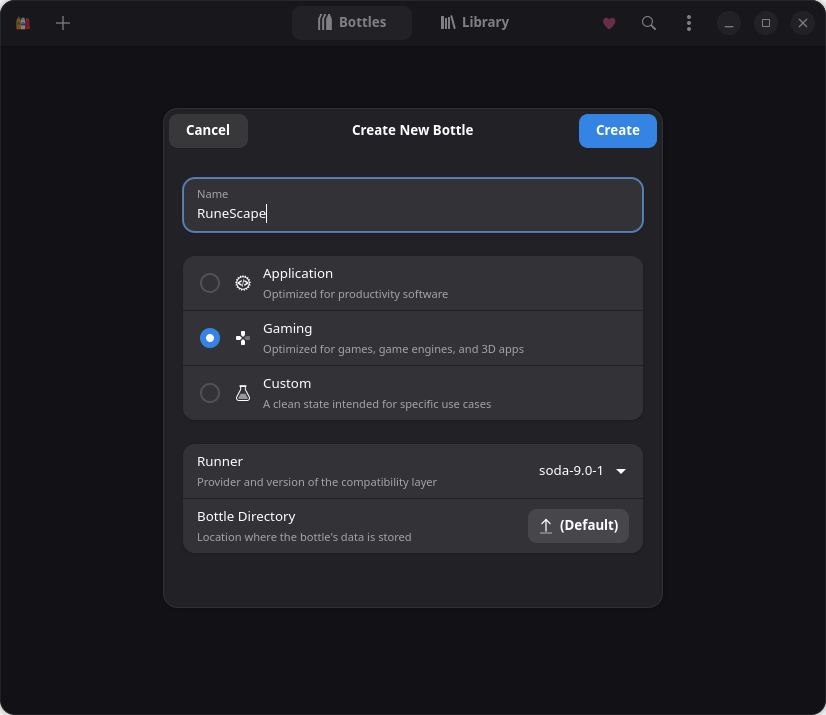
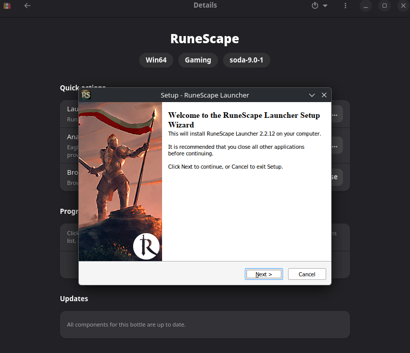
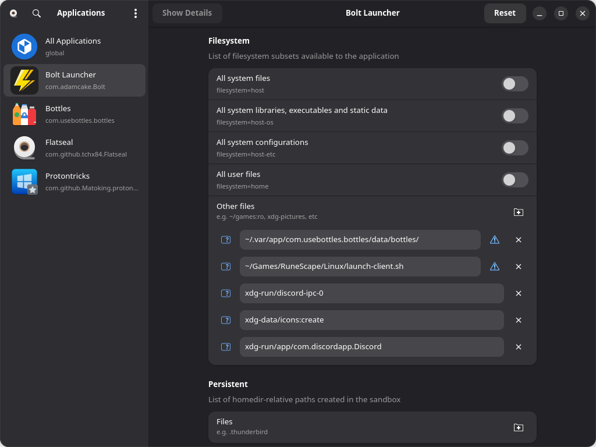
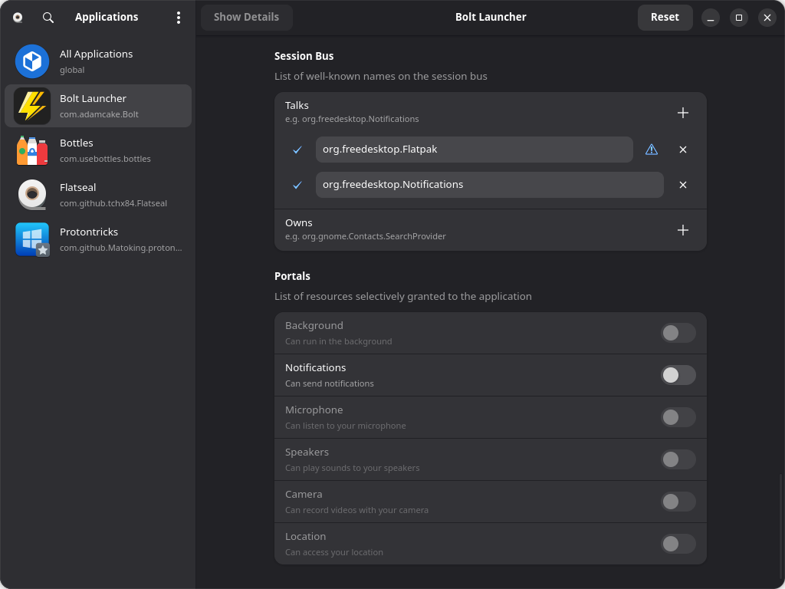
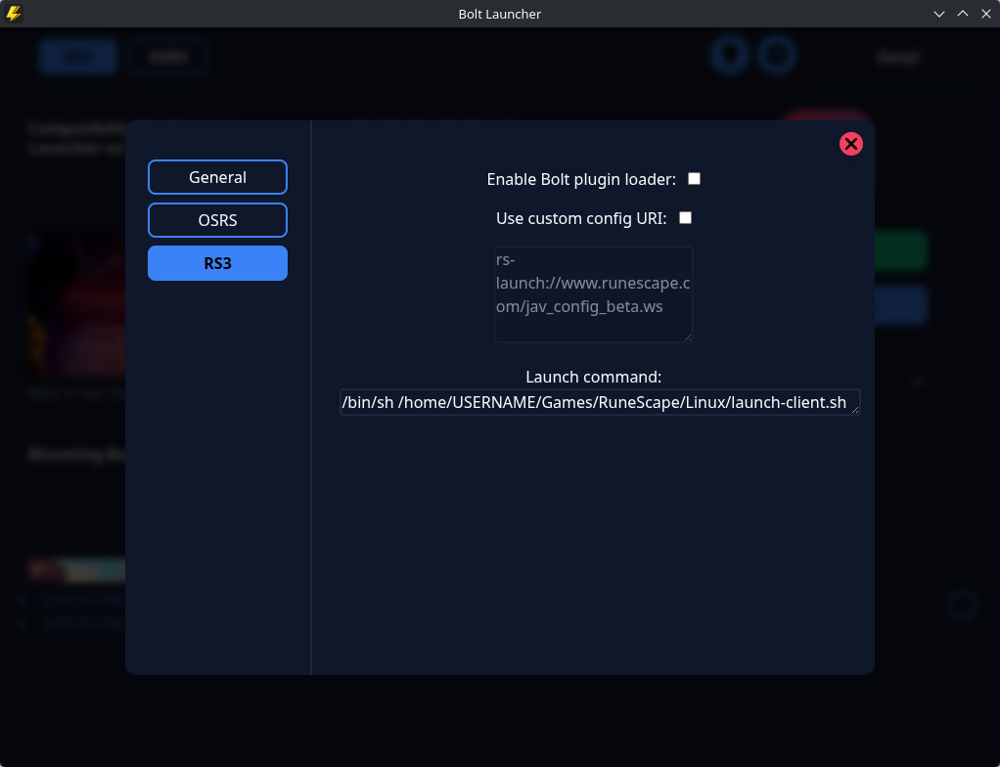
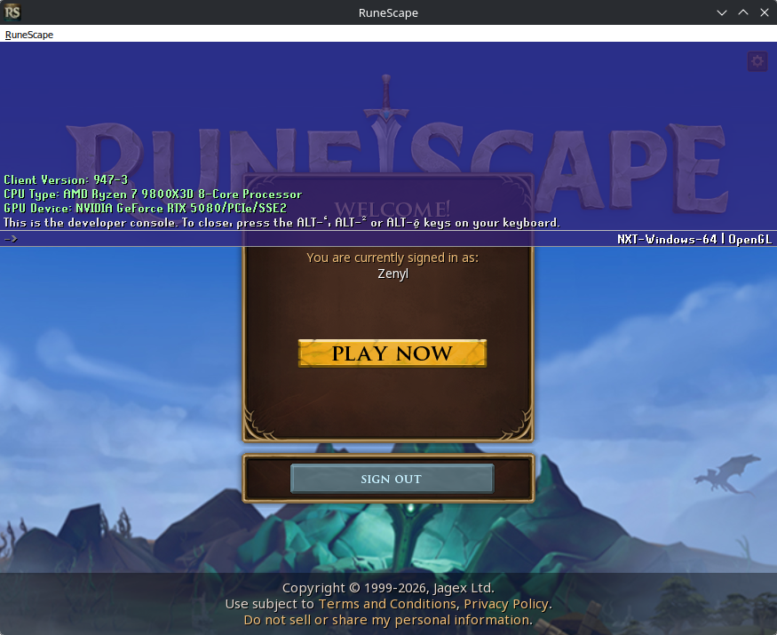
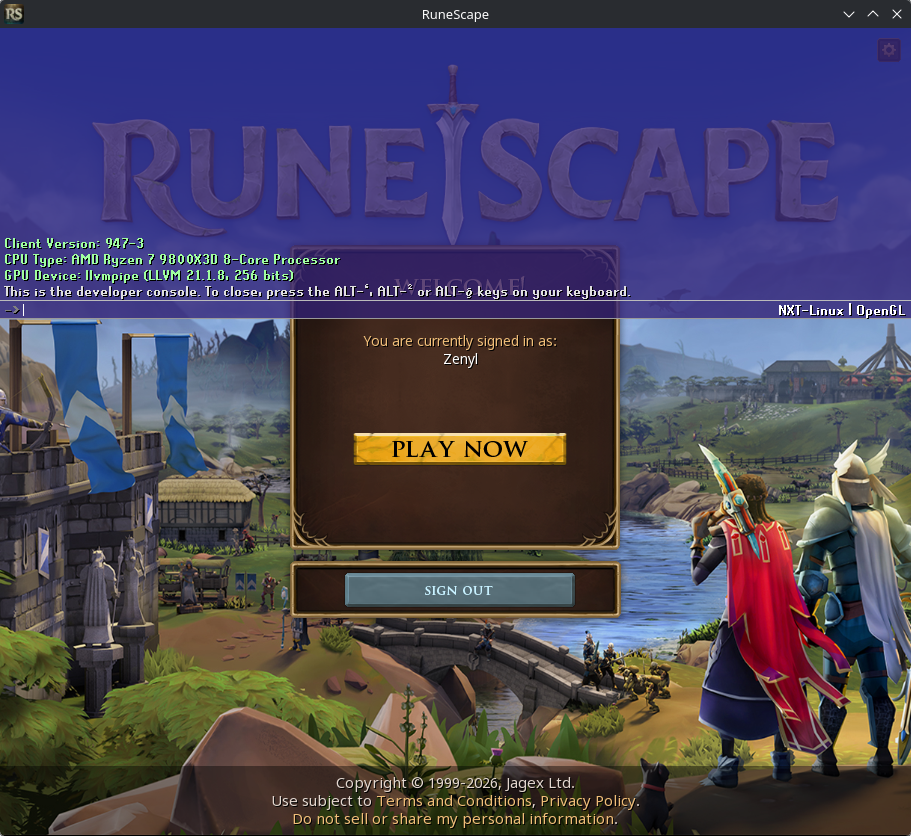
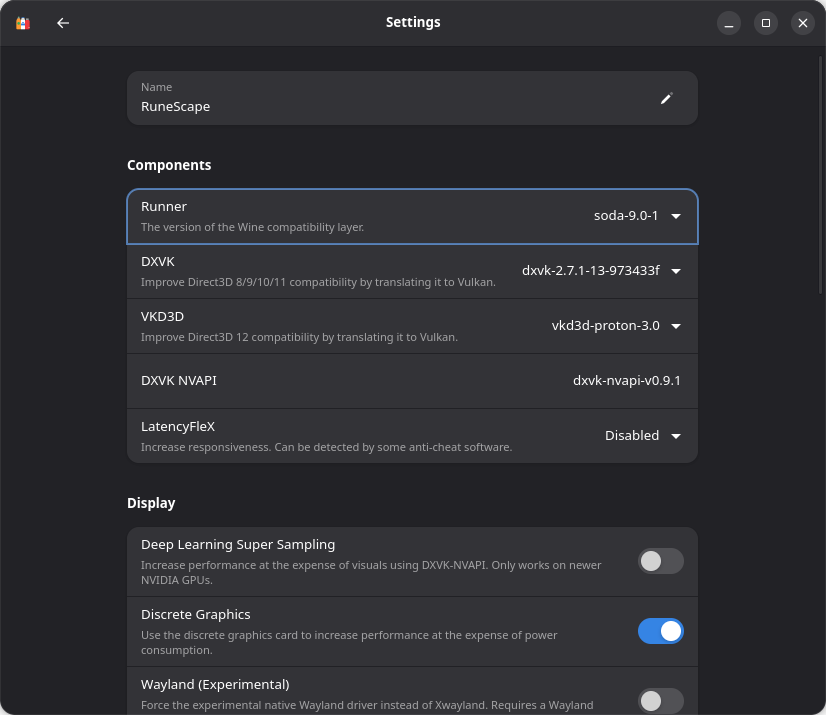

# RuneScape on Linux (NVIDIA + Wayland, without Steam)

## Introduction

Getting RuneScape (aka. "RuneScape 3") to run on Linux can be tricky, particularly on computers with NVIDIA GPUs and a Wayland desktop environment.

This is in large part because Jagex does not provide adequate support or maintenance for playing RuneScape on Linux, which has resulted in an increasing number of problems as the Linux eco system evolves over time.

The Jagex Launcher is not supported at Linux, and the Linux-native game client defaults to CPU rendering on NVIDIA+Wayland systems (resulting in very poor performance).

Attempts have been made to force the Linux-native game client to detect NVIDIA GPUs on Wayland, however this led other problems including a memory leak which will eventually cause the computer to run out of memory.

A common solution is to play [RuneScape on Steam](https://store.steampowered.com/app/1343400/RuneScape/), using [Proton](https://en.wikipedia.org/wiki/Proton_(software)) to run the game. This solution works, but not everyone wishes to connect their Jagex account to a Steam account, and playing on multiple characters at the same time isn't trivial when playing through Steam.

## Remarks

- This method requires using the [Bolt launcher](https://codeberg.org/Adamcake/Bolt), a third-party alternative to the Jagex Launcher, to sign into your Jagex account.
- This method of running RuneScape on Linux is not compatible with Bolt plugins.
- Support for Alt1 or similar is untested and not guaranteed.
- On computers not using NVIDIA+Wayland, Bolt should work out-of-the-box and run its internal installation of RuneScape, without any performance issues, and without needing to install or use Bottles or Flatseal.
- This is intended for non-immutable Linux distributions. For immutable systems, additional work may be required to persist the changes to the system.
- This has only been tested on my own computer (KDE Plasma, Arch Linux, NVIDIA RTX 5080, GPU driver `nvidia-open 595.58.03-2`). This may not work on your computer.
- I am not affiliated with Jagex or with Bolt.

## Prerequisites

- A Jagex account
- A working Linux installation
- Knowing how to install software using your Linux distribution's package manager
- An NVIDIA GPU with drivers installed and working

## Installation guide

### Applications

- Install [Flatpak](https://flatpak.org/) with your Linux distribution's package manager. Flatpak is a cross-distribution package manager.
- Install the following Flatpaks:
    - [Bolt Launcher](https://flathub.org/en/apps/com.adamcake.Bolt) (third-party alternative to the Jagex Launcher)
        - `com.adamcake.Bolt`
    - [Bottles](https://flathub.org/en/apps/com.usebottles.bottles) (for managing [Wine](https://www.winehq.org/) environments to run Windows applications on Linux)
        - `com.usebottles.bottles`
    - [Flatseal](https://flathub.org/en/apps/com.github.tchx84.Flatseal) (for configuring Wine environments)
        - `com.github.tchx84.Flatseal`
- Notes
    - Depending on your system, you can either use graphical installers that support Flatpak (e.g. [Discover](https://apps.kde.org/discover/) from KDE), or you may need to use Flatpak's commandline.
    - If prompted to choose between "system" and "user", select "system" by entering `1`.
    - If prompted about permissions or additional dependencies, agree to do so.
    - As is always the case with software, it is strongly recommended that you install updates when they become available.

### Downloading the RuneScape installer

- Download the RuneScape game client (not the Jagex Launcher) installer for Windows
    - Download page: https://www.runescape.com/download?force_test=control
    - Note: Make sure the file you've downloaded is `RuneScape-Setup.exe`, and not `Jagex Launcher Installer.exe`
    - How to find this page for yourself
        - Go to the RuneScape website
        - Click "Download" in the menu bar
        - Scroll down and click the small link that reads "Game Direct Download"

###  Installing RuneScape using Bottles

Bolt will normally handle this on its own, however it will use the Linux-native game client. So the game client needs to be installed manually.

- Launch Bottles
- Create a new bottle ("+" button in the top-left corner)
    - Name: "RuneScape" (note: this is case sensitive)
    - Select "Gaming"
    - Make sure the runner set to "soda" (the version shouldn't matter)
- 
- Click "Run Executable...", and select the `RuneScape-Setup.exe` file you downloaded
- Go through the installation process



- Note: Do not change any options from their default values.

### Download the helper script

The helper script tells Bolt how to launch the RuneScape game client you installed with Bottles, and passes your authentication IDs so the game will automatically sign into the character you've selected in Bolt.

- Download the [`launch-client.sh`](launch-client.sh) script from this repository
- Save it to `$HOME/Games/RuneScape/Linux/`
    - Make sure to create the necessary directories
    - Note: `$HOME` is meant to be substituted for your Linux home directory, typically `/home/USERNAME`
    - Note: If you copy it to a different location, you will need to adjustments where the script is being referenced accordingly. This guide will mention when to do so.
- Note: If you're not sure if you did this correctly, launch a terminal and run the following script to validate that the script exists in the expected location:

```sh
[ -f "$HOME/Games/RuneScape/Linux/launch-client.sh" ] && echo "Script found" || echo "Script not found"
```

### Tweaking Bolt's flatpak

- Launch Flatseal
- Select "Bolt Launcher"
- Scroll down to "Filesystem"
    - Add a new entry under "Other files" with the text `~/Games/RuneScape/Linux/launch-client.sh`
        - This lets Bolt see the the `launch-client.sh` script
        - If you changed where `launch-client.sh` is located, make sure to change this accordingly
    - Add another new entry under "Other files" with the text `~/.var/app/com.usebottles.bottles/data/bottles/`
        - This lets Bolt launch Bottles' Wine executable



- Scroll down to "Session Bus"
    - Add a new entry under "Talks" with the text `org.freedesktop.Flatpak`
        - This lets Bolt launch processes outside of its Flatpak environment



### Configuring Bolt

- Launch Bolt
- Sign into your Jagex account
    - Click "Login" in the top-right corner of the window, this will open a new window for authentication
        - This is the same login screen you see when you sign into your Jagex account on the Jagex Launcher
- Your account name will be visible in the top-right corner of the window
- Make sure "RS3" is selected from the top bar
- Click the settings button (round button with a cog icon)
- Select "RS3"
- Change the launch command the following: `/bin/sh /home/USERNAME/Games/RuneScape/Linux/launch-client.sh`
    - Note: Make sure to change "USERNAME" to the username of your user on your Linux installation
        - If you're not sure what your username is, launch a terminal window and run the command `whoami`
    - Note: This input field is fairly small, use the arrow keys to verify that this is the full text of the
- If you changed where `launch-client.sh` is located, make sure to change this accordingly
- Close the configuration menu



### Verify that the game works correctly

- Using Bolt, select a character from the drop-down menu, and click "Play"
- The RuneScape splash screen should appear, followed by the game launching you into the lobby
- Launch the [developer console](https://runescape.wiki/w/Developer_console)
- The developer console contain some text, including "GPU Device" in green. This should say something similar to "NVIDIA GeForce RTX 5080/PCIe/SSE2" (specific to your GPU). In the bottom-right of the developer console, it should say "NXT-Windows-64 | OpenGL"

Example of the developer console with GPU rendering, running the Windows-native game client:



- Note: If you wish to check your FPS using the `displayfps` command, make sure to fully log in. The lobby limits your FPS to 60. You might also need to change your "Foreground FPS" and "Background FPS" in the in-game graphics settings menu.

## Troubleshooting

### Very poor performance (low FPS)

This is usually caused by the game not using your GPU, and instead using your CPU to render the game's graphics.

To verify that this is the case, launch the [developer console](https://runescape.wiki/w/Developer_console), and read the text in green that starts with "GPU Device". If this says "llvmpipe (LLVM 21.1.8, 256 bits)" or similar, it means the game is using your CPU instead of your GPU to render the game, which will result in very poor performance.

Also, check the text in the bottom-right corner of the developer console, and see if it reads "NXT-Linux | OpenGL".

If the above are true, the cause is likely that the launch command for Bolt has not been changed to point to the helper script, and Bolt is therefore defaulting to running its internal (Linux-native) game client.

Example of the developer console with CPU rendering (`llvmpipe`), running the Linux-native game client:



To resolve this issue, change Bolt's launch command as specified in the installation guide.

### FPS capped at 60

This is usually related to Wine not being optimized/configured correctly for the game.

Verify that you are using Bottles' version of Wine (Soda), and not regular Wine.

- Launch Bottles
- Click the "RuneScape" bottle
- Under "Options", click on "Settings"
- Under "Components", make sure the "Runner" is set to `soda-9.0.1` (or similar), and not `sys-wine-11.0` (or similar). Soda is the version of Wine that Bottles comes with, which is better for running RuneScape than regular Wine.


